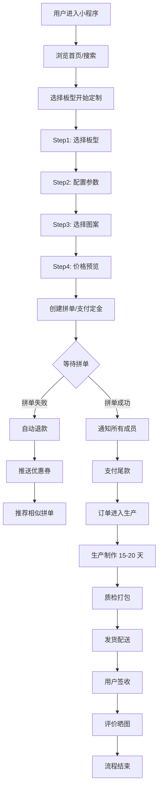
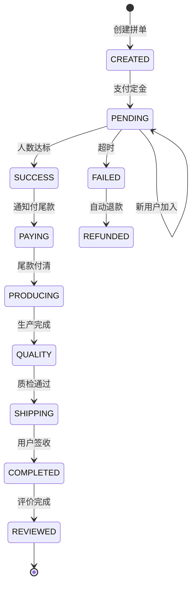
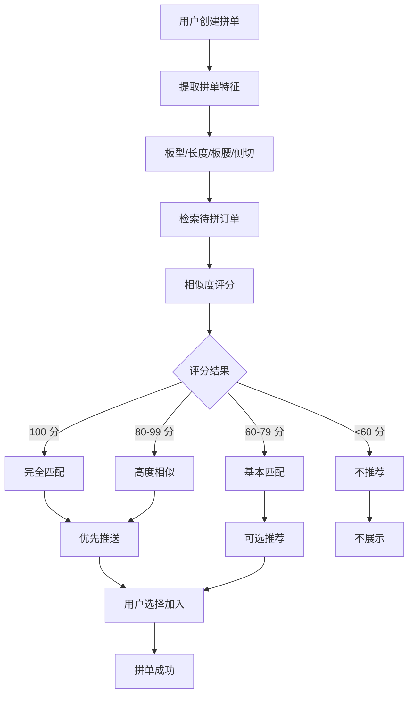
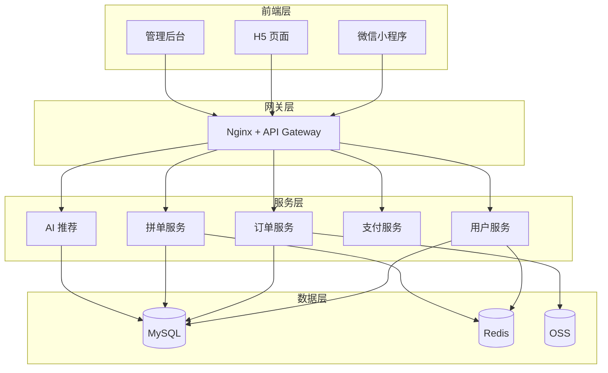
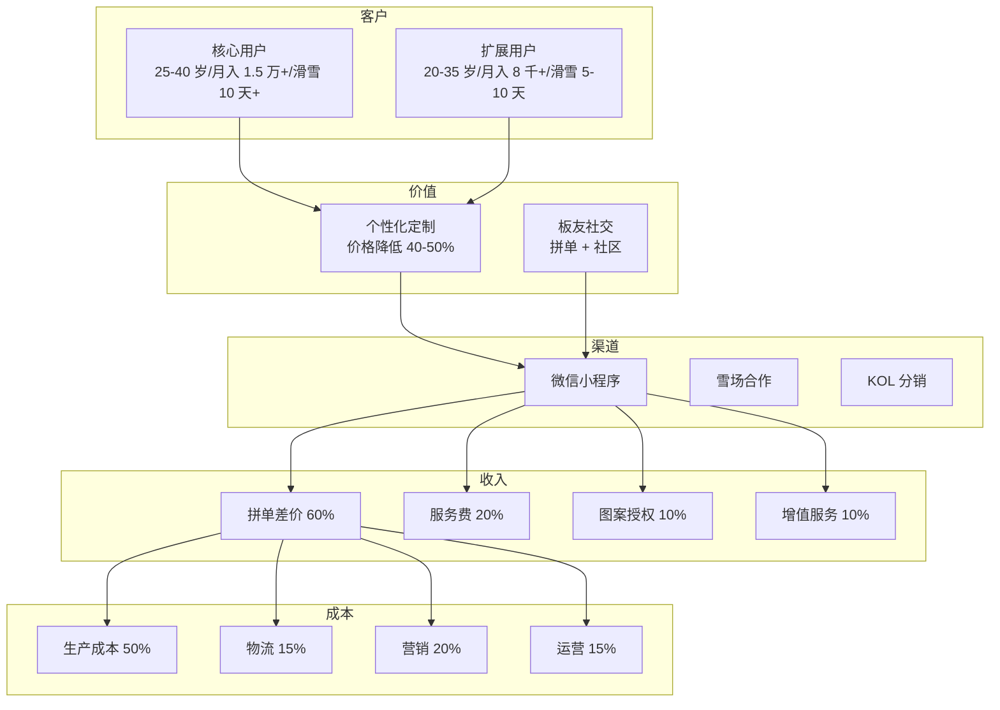
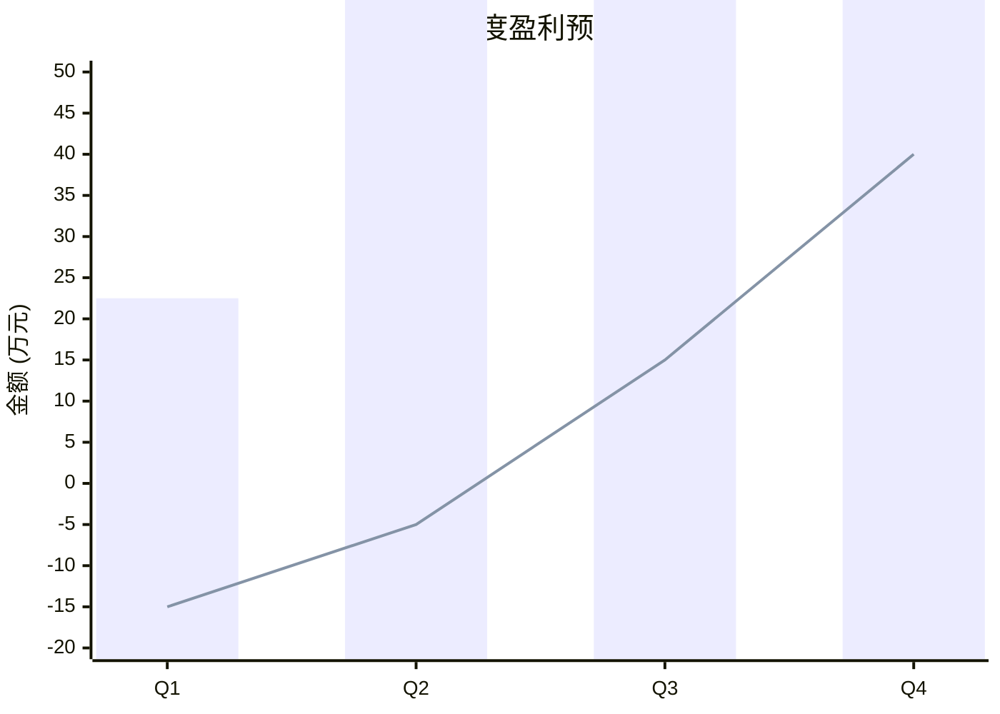
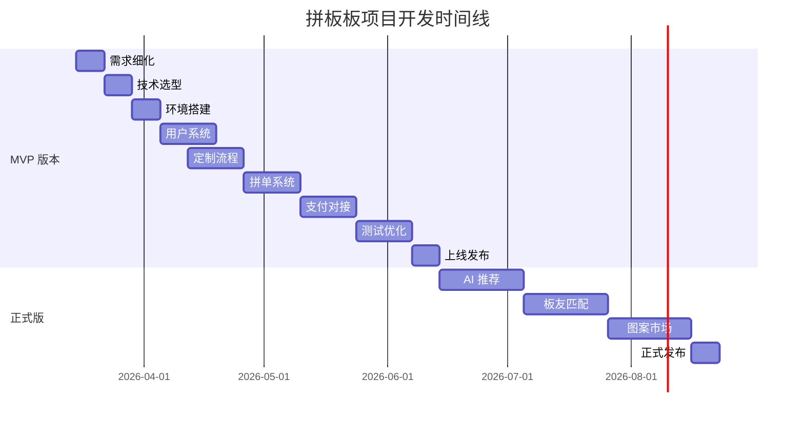

# 拼板板 - 可视化流程图 (Mermaid)

---

## 1. 用户拼单主流程



---

## 2. 拼单状态机



---

## 3. 拼单匹配逻辑



---

## 4. 系统架构



---

## 5. 订单处理流程

```mermaid
sequenceDiagram
    participant 用户
    participant 小程序
    participant 后端
    participant 工厂
    participant 物流
    
    用户->>小程序：创建拼单
    小程序->>后端：保存订单
    后端->>后端：等待拼单
    
    loop 等待成员加入
        用户->>小程序：加入拼单
        小程序->>后端：更新进度
        后端->>小程序：推送通知
    end
    
    后端->>后端：拼单成功
    后端->>用户：通知付尾款
    用户->>后端：支付尾款
    
    后端->>工厂：发送生产单
    工厂->>后端：确认排期
    工厂->>后端：生产完成
    
    后端->>工厂：质检
    工厂->>后端：质检通过
    
    后端->>物流：发货
    物流->>用户：配送
    用户->>后端：确认收货
```

---

## 6. 商业模式画布



---

## 7. 盈利预测



---

## 8. 项目时间线



---

*流程图版本：v1.0*  
*更新日期：2026-03-13*

**说明**：以上 Mermaid 图表可在支持 Mermaid 的编辑器中渲染查看，如：
- GitHub/GitLab
- Notion
- Obsidian
- VS Code (Mermaid 插件)
- 在线编辑器：https://mermaid.live
